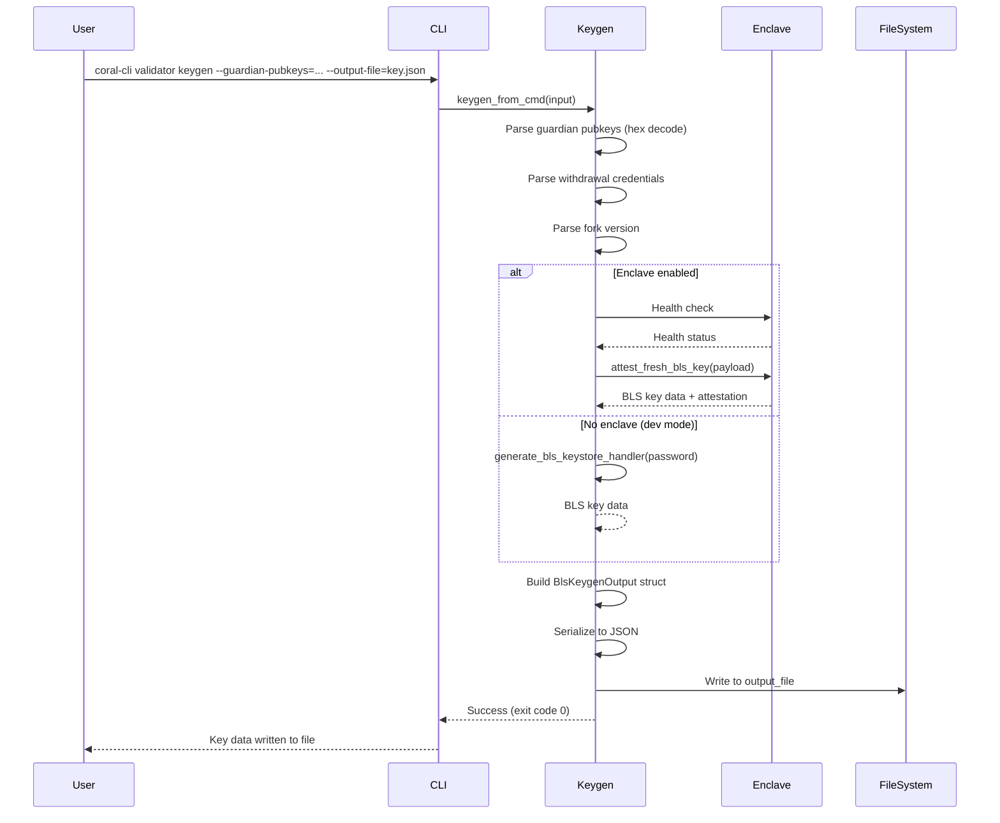
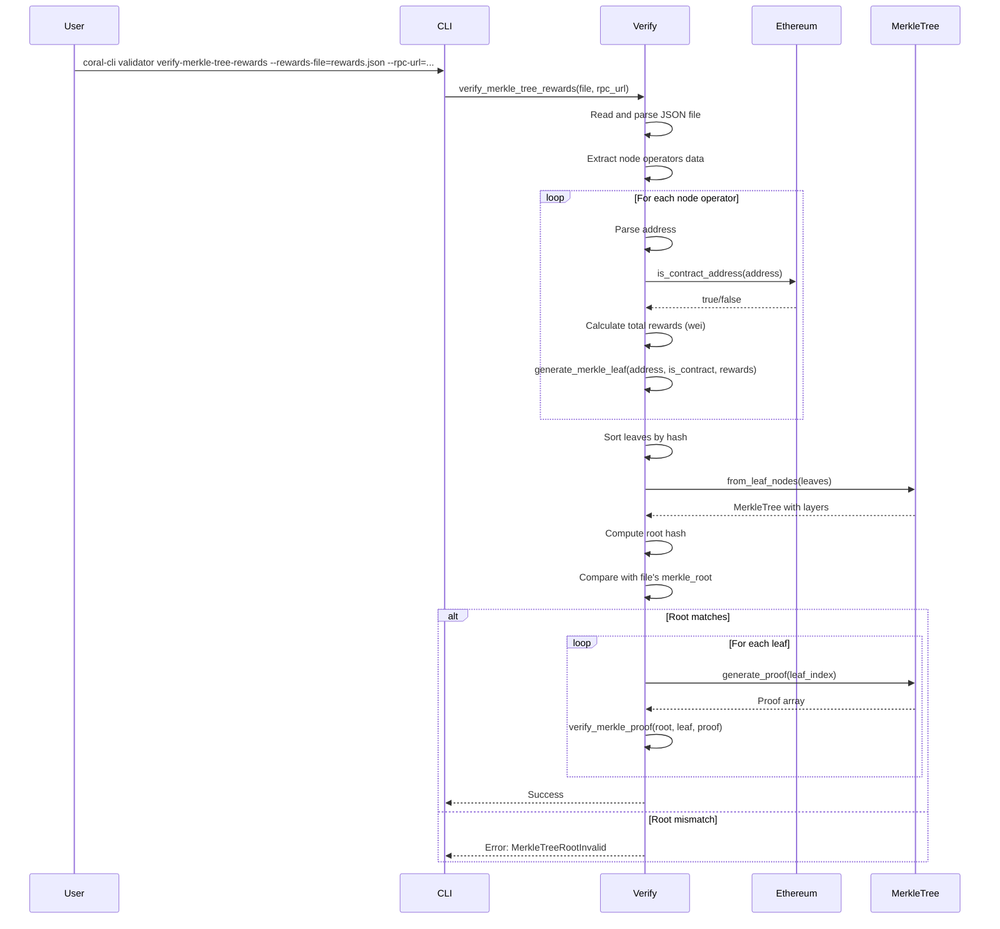
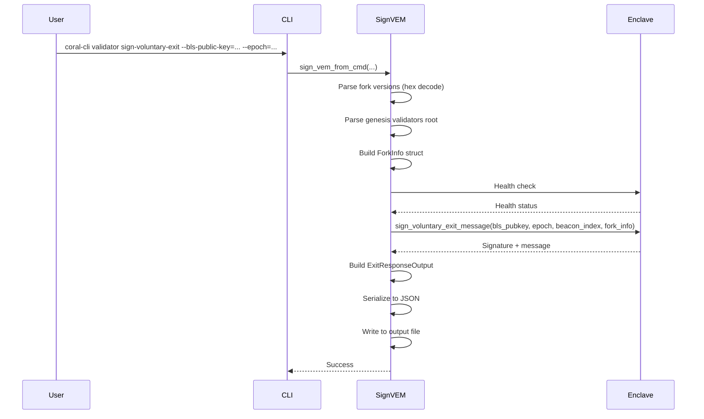
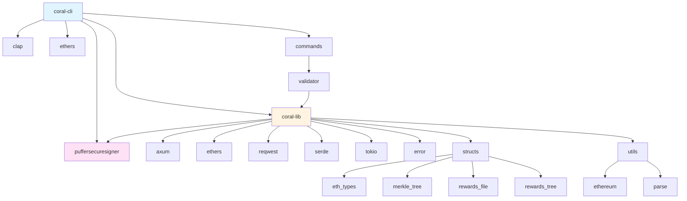
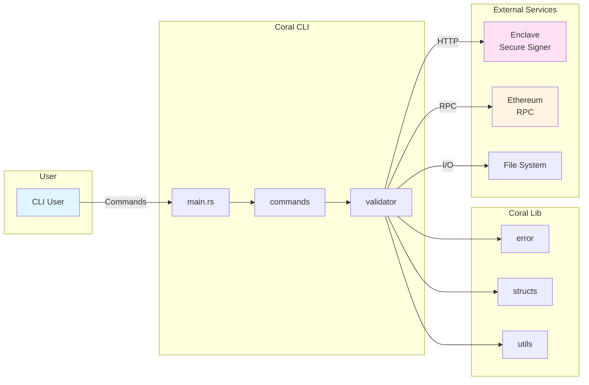
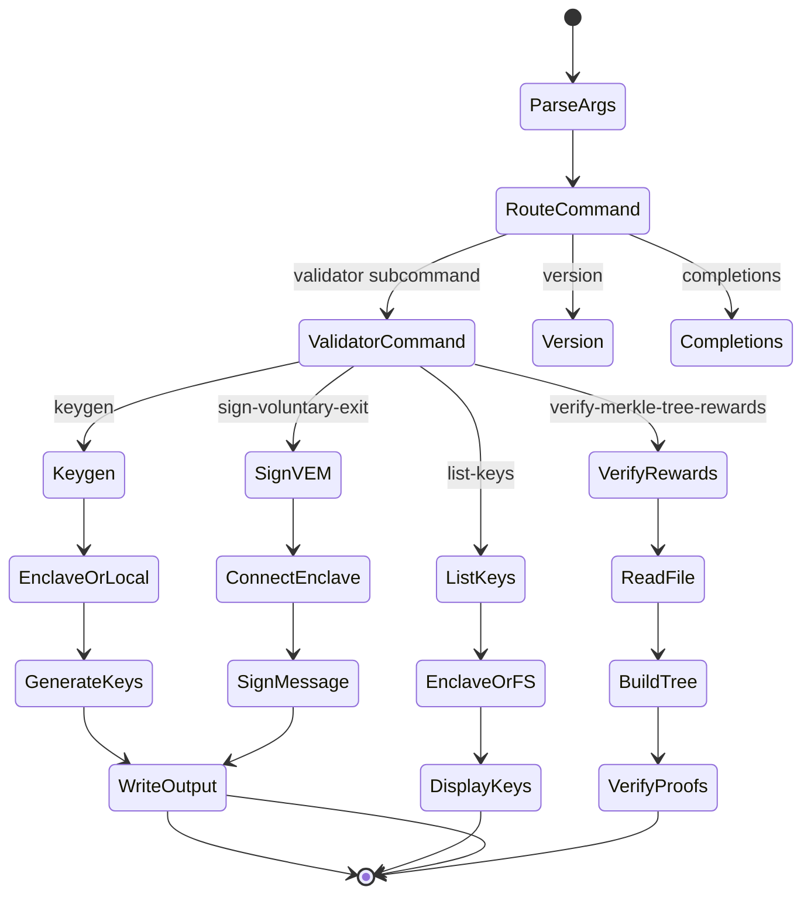

# Coral Architecture Guide

## Table of Contents

1. [High-Level Overview](#high-level-overview)
2. [Module-by-Module Breakdown](#module-by-module-breakdown)
3. [Rust-Specific Guidance](#rust-specific-guidance)
4. [Flow Explanations](#flow-explanations)
5. [Code Reading Assistance](#code-reading-assistance)
6. [Architecture Charts](#architecture-charts)
7. [Recommendations](#recommendations)

---

## High-Level Overview

### What is Coral?

**Coral** is middleware that facilitates communication between **Intel SGX Enclaves** (secure execution environments) and **Puffer smart contracts** on Ethereum. It's a critical component in Puffer's validator infrastructure, handling:

-   **BLS Key Generation**: Creating validator keys with threshold cryptography
-   **Key Management**: Listing and managing validator keys stored in enclaves
-   **Voluntary Exit Signing**: Signing voluntary exit messages for validators
-   **Rewards Verification**: Verifying merkle tree proofs for validator rewards

### System Architecture

```
┌─────────────────────────────────────────────────────────────┐
│                    Coral System Architecture                 │
└─────────────────────────────────────────────────────────────┘

┌──────────────┐         ┌──────────────┐         ┌──────────────┐
│   Ethereum   │◄───────►│    Coral     │◄───────►│   Enclave    │
│  Smart       │  RPC    │   (CLI/Lib)  │  HTTP   │  (Secure     │
│  Contracts   │         │              │         │   Signer)    │
└──────────────┘         └──────────────┘         └──────────────┘
                              │
                              │ File I/O
                              ▼
                        ┌──────────────┐
                        │  Keystores   │
                        │  & Configs   │
                        └──────────────┘
```

### Project Structure

Coral is organized as a **Rust workspace** with two main crates:

1. **`coral-lib`**: Core library containing shared functionality

    - Error handling
    - Data structures (Ethereum types, merkle trees, rewards)
    - Utilities (parsing, Ethereum interactions)

2. **`coral-cli`**: Command-line interface application
    - CLI argument parsing
    - Validator commands (keygen, list, sign, verify)
    - Integration with enclave and Ethereum

---

## Module-by-Module Breakdown

### Workspace Structure

```mermaid graph
    A[Coral Workspace] --> B[coral-lib]
    A --> C[coral-cli]
    B --> D[error]
    B --> E[structs]
    B --> F[utils]
    C --> G[commands]
    C --> B
    G --> H[validator]
```

### 1. `coral-lib` - Core Library

#### Purpose

Shared library providing common functionality for both CLI and potential server components.

#### Key Modules

##### `error/` - Error Handling System

**Purpose**: Centralized error handling with type-safe error types.

**Key Types**:

-   `AppError`: Main error type with kind and cause message
-   `AppErrorKind`: Enumeration of error categories
-   `ServerErrorResponse`: HTTP-compatible error responses
-   `AppResult<T>`: Type alias for `Result<T, AppError>`

**Rust Concepts Demonstrated**:

-   **Type aliases**: `pub type AppResult<T> = Result<T, AppError>`
-   **Trait implementations**: `From` trait for error conversion
-   **Error propagation**: Using `?` operator

**Example from code**:

```rust
// Type alias for cleaner code
pub type AppResult<T = ()> = Result<T, AppError>;

// Automatic error conversion
impl From<io::Error> for AppError {
    fn from(err: io::Error) -> Self {
        Self {
            _kind: AppErrorKind::from(err),
            _cause: err.to_string(),
        }
    }
}
```

##### `structs/` - Data Structures

**Purpose**: Define core data types used throughout the application.

**Key Modules**:

1. **`eth_types.rs`**: Ethereum-specific type aliases

    ```rust
    pub type ForkVersion = [u8; 4];  // 4-byte fork version
    pub type Root = [u8; 32];        // 32-byte root hash
    pub type WithdrawalCredentials = [u8; 32];  // 32-byte credentials
    ```

    - Uses **type aliases** for semantic clarity
    - Fixed-size arrays for cryptographic data

2. **`merkle_tree.rs`**: Merkle tree implementation

    - `MerkleTree`: Tree structure with layers
    - `verify_merkle_proof()`: Proof verification function
    - **Key Rust concepts**:
        - **Ownership**: Tree owns its layers
        - **Iterators**: `leaf_nodes()` returns iterator
        - **Pattern matching**: Used in proof generation

3. **`rewards_file.rs`**: Rewards data structures

    - `RewardsRawFile`: JSON deserialization structure
    - `NodeOperator`: Per-operator reward data
    - **Custom deserialization**: `deserialize_u256_from_number` for U256

4. **`rewards_tree.rs`**: Rewards merkle tree logic
    - `generate_merkle_leaf()`: Creates merkle leaf from address/rewards
    - Double-hashing for security (prevents second preimage attacks)

##### `utils/` - Utility Functions

**Purpose**: Helper functions for common operations.

1. **`ethereum.rs`**: Ethereum blockchain interactions

    - `get_provider()`: Creates HTTP provider
    - `get_client()`: Creates signed client with wallet
    - Uses **generics** with trait bounds for flexibility

2. **`parse.rs`**: Parsing utilities
    - `parse_module_name()`: Converts hex string to 32-byte array
    - `parse_address()`: Parses Ethereum addresses
    - **Error handling**: Returns `AppServerResult` with detailed errors

### 2. `coral-cli` - Command-Line Interface

#### Purpose

CLI application for interacting with Puffer validators and enclaves.

#### Key Modules

##### `main.rs` - Entry Point

**Purpose**: Application entry point and command routing.

**Key Features**:

-   Uses `clap` for argument parsing
-   Async runtime with `tokio::main`
-   Error handling with colored output

**Rust Concepts**:

-   **Async/await**: `async fn run_main()`
-   **Macros**: `#[tokio::main]` attribute macro
-   **Pattern matching**: `match` for command routing

##### `commands/` - Command Handlers

**Purpose**: Organize CLI commands into modules.

1. **`mod.rs`**: Command routing

    - `CommandArgs`: Top-level command structure
    - `SubCommand`: Enum of available commands
    - Uses **enums** for type-safe command variants

2. **`validator/`**: Validator-specific commands
    - `keygen.rs`: BLS key generation
    - `list_keys.rs`: List validator keys
    - `sign_vem.rs`: Sign voluntary exit messages
    - `verify_merkle_tree_rewards.rs`: Verify rewards merkle proofs

---

## Rust-Specific Guidance

### Ownership and Borrowing

Rust's ownership system is central to this codebase. Here are key examples:

#### 1. Ownership Transfer

```rust
// From keygen.rs - ownership is moved into the struct
let input_data = BlsKeygenInput {
    guardian_pubkeys,  // ownership moved here
    guardian_threshold,
    // ...
};
```

#### 2. Borrowing with References

```rust
// From list_keys.rs - borrowing with &str
pub async fn list_keys(
    disable_enclave: bool,
    keystore_path: Option<String>,  // owned String
    enclave_url: Option<String>,     // owned String
) -> AppResult<i32>
```

#### 3. Mutable Borrowing

```rust
// From merkle_tree.rs - mutable reference for swapping
if right <= left {
    std::mem::swap(&mut right, &mut left);  // mutable borrows
}
```

### Lifetimes

While this codebase doesn't use explicit lifetime parameters extensively, they're implicit in:

1. **String slices (`&str`)**:

    ```rust
    pub fn strip_0x_prefix(s: &str) -> &str  // implicit lifetime
    ```

2. **Iterator lifetimes**:
    ```rust
    pub fn leaf_nodes(&self) -> Iter<[u8; 32]>  // borrows from self
    ```

### Common Rust Idioms

#### 1. Result<T, E> for Error Handling

**Everywhere** in this codebase:

```rust
// Pattern: Return Result, use ? for propagation
pub async fn keygen_from_cmd(data: KeygenCmdInput) -> AppResult<i32> {
    let password = match password_file {
        None => None,
        Some(path) => {
            let password = std::fs::read_to_string(path)
                .inspect_err(|err| { /* logging */ })?;  // ? propagates error
            Some(password.trim().to_string())
        }
    };
    // ...
}
```

**Key points**:

-   `?` operator automatically converts and propagates errors
-   `inspect_err()` allows side effects (logging) before propagation
-   Functions return `Result` types, never panic

#### 2. Option<T> for Optional Values

```rust
// From list_keys.rs
let keystore_path = match keystore_path {
    Some(path) => path,  // extract value
    None => {
        return Err(AppError::new(/* ... */));  // early return
    }
};
```

**Pattern**: Use `match` or `unwrap_or()` for safe unwrapping.

#### 3. Pattern Matching

**Extensive use** throughout:

```rust
// From commands/mod.rs
match command {
    SubCommand::Version => { /* ... */ },
    SubCommand::Completions { shell } => { /* ... */ },
    SubCommand::Validator(subcommand) => subcommand.execute().await,
}
```

**Destructuring**:

```rust
// From keygen.rs
let KeygenCmdInput {
    guardian_pubkeys,
    guardian_threshold,
    // ... destructure all fields
} = data;
```

#### 4. Smart Pointers

**`Arc<T>`** (Atomically Reference Counted):

```rust
// From ethereum.rs
pub fn get_client<J, E>(
    provider: Provider<J>,
    wallet: LocalWallet,
    chain_id: u64,
) -> Arc<SignerMiddleware<Provider<J>, LocalWallet>>
```

-   Used for shared ownership across threads
-   Needed for async contexts where data might be moved

#### 5. Traits

**Trait bounds** for generics:

```rust
// From ethereum.rs
pub async fn get_chain_id<J, E>(provider: &Provider<J>) -> AppServerResult<U256>
where
    J: JsonRpcClient<Error = E>,  // trait bound
{
    // ...
}
```

**Trait implementations**:

```rust
// From error/error_type.rs
impl From<io::Error> for AppError {
    fn from(err: io::Error) -> Self {
        // conversion logic
    }
}
```

#### 6. Async/Await

**Async functions** throughout:

```rust
// From main.rs
#[tokio::main]
async fn main() {
    let args = CommandArgs::parse();
    match run_main(args).await {  // await async result
        Ok(exit_code) => process::exit(exit_code),
        Err(err) => { /* handle error */ }
    }
}
```

**Key points**:

-   `async fn` functions return `Future` types
-   `.await` suspends execution until future completes
-   `tokio` provides the async runtime

### Macros

#### 1. Attribute Macros

```rust
#[tokio::main]  // Transforms main() into async runtime setup
async fn main() { /* ... */ }
```

#### 2. Derive Macros

```rust
#[derive(Clone, Debug, Serialize, Deserialize)]  // Auto-generate implementations
pub struct BlsKeygenInput {
    // ...
}
```

#### 3. Function-like Macros

```rust
// From main.rs (dev feature)
#[cfg(feature = "dev")]
abigen!(PufferOracle, "./abi/PufferOracleV2.json");
```

-   `abigen!` generates Rust bindings from ABI JSON
-   `#[cfg(feature = "dev")]` conditionally compiles

### Unsafe Blocks

**Good news**: This codebase contains **NO unsafe blocks**! All memory safety is guaranteed by Rust's type system.

### Type System Features

#### 1. Type Aliases

```rust
// Semantic clarity
pub type AppResult<T> = Result<T, AppError>;
pub type ForkVersion = [u8; 4];
```

#### 2. Generic Functions

```rust
// From ethereum.rs
pub async fn get_block<J, E>(
    provider: &Provider<J>,
    block_number: BlockNumber,
) -> AppServerResult<Block<H256>>
where
    J: JsonRpcClient<Error = E>,
```

#### 3. Associated Types

Used implicitly through trait bounds (e.g., `JsonRpcClient<Error = E>`).

---

## Flow Explanations

### Flow 1: BLS Key Generation

This is the most complex flow in the codebase. Let's trace it step-by-step:



**Step-by-step breakdown**:

1. **CLI Parsing** (`main.rs` → `commands/mod.rs`):

    - User provides command-line arguments
    - `clap` parses into `ValidatorCommand::Keygen`
    - Routes to `keygen::keygen_from_cmd()`

2. **Input Processing** (`keygen.rs:75-114`):

    - Parses comma-separated guardian pubkeys
    - Reads password file if provided
    - Validates input formats

3. **Key Generation** (`keygen.rs:116-249`):

    - **Enclave path**: Connects to secure enclave, performs remote attestation
    - **Local path**: Uses password-protected keystore generation
    - Both paths produce BLS key shares with threshold cryptography

4. **Output Generation** (`keygen.rs:251-283`):
    - Constructs `BlsKeygenOutput` with all key data
    - Serializes to pretty JSON
    - Writes to file system

**Rust concepts in this flow**:

-   **Error propagation**: `?` operator at each step
-   **Ownership**: Data moved through function calls
-   **Async/await**: Enclave calls are async
-   **Pattern matching**: `match` for enclave vs local paths

### Flow 2: Merkle Tree Rewards Verification



**Key steps**:

1. **File Reading** (`verify_merkle_tree_rewards.rs:17-42`):

    - Opens JSON file
    - Deserializes into `RewardsRawFile` struct
    - Uses custom deserializer for `U256` types

2. **Leaf Generation** (`verify_merkle_tree_rewards.rs:44-67`):

    - Iterates over node operators
    - Checks if address is contract (async Ethereum call)
    - Generates merkle leaf using double-hash

3. **Tree Construction** (`merkle_tree.rs:13-53`):

    - Pads leaves to power-of-2 size
    - Builds tree bottom-up using Keccak256 hashing
    - Sorts siblings before hashing (deterministic ordering)

4. **Proof Verification** (`verify_merkle_tree_rewards.rs:96-117`):
    - Generates proof for each leaf
    - Verifies proof against root
    - All proofs must verify for success

**Rust concepts**:

-   **Iterators**: `leaves.iter().enumerate()`
-   **Closures**: `validator_hashes.sort_by(|a, b| a.hash.cmp(&b.hash))`
-   **Async**: Ethereum RPC calls are async
-   **Ownership**: Tree owns its layers, proofs are borrowed

### Flow 3: Voluntary Exit Signing



**Key points**:

-   Fork version parsing uses fixed-size arrays `[u8; 4]`
-   Enclave performs the actual BLS signature
-   Output format matches Ethereum beacon chain requirements

---

## Code Reading Assistance

### File-by-File Guide

#### `coral-lib/src/lib.rs`

**Purpose**: Library root, exports public API.

**Key Items**:

-   `strip_0x_prefix()`: Utility for hex strings
-   `add_0x_prefix()`: Adds "0x" prefix if missing
-   Module exports: `error`, `structs`, `utils`

**Rust Constructs**:

-   `#[inline]`: Suggests inlining for performance (small functions)
-   `unwrap_or()`: Safe unwrapping with default

#### `coral-cli/src/main.rs`

**Purpose**: Application entry point.

**Key Items**:

-   `run_main()`: Async main logic
-   `print_version()`: Version display
-   Error handling with colored output

**Rust Constructs**:

-   `#[tokio::main]`: Macro that sets up async runtime
-   `process::exit()`: Explicit exit codes
-   `colored::Colorize`: Trait for string coloring

#### `coral-lib/src/structs/merkle_tree.rs`

**Purpose**: Merkle tree data structure and algorithms.

**Key Functions**:

-   `from_leaf_nodes()`: Constructs tree from leaves
-   `root_hash()`: Returns root hash
-   `generate_proof()`: Creates merkle proof
-   `verify_merkle_proof()`: Verifies proof

**Rust Constructs**:

-   **Ownership**: Tree owns `layers: Vec<Vec<[u8; 32]>>`
-   **Iterators**: `leaf_nodes()` returns `Iter<[u8; 32]>`
-   **Pattern matching**: Used in proof generation
-   **Fixed arrays**: `[u8; 32]` for hash values

**Simplified Pseudocode**:

```
function from_leaf_nodes(leaf_nodes):
    // Pad to power of 2
    while leaf_count < next_power_of_2:
        leaf_nodes.append([0; 32])

    layers = [leaf_nodes]
    current_layer = leaf_nodes

    while current_layer.length > 1:
        next_layer = []
        for each pair (left, right) in current_layer:
            if right < left: swap(left, right)
            hash = keccak256(left || right)
            next_layer.append(hash)
        layers.append(next_layer)
        current_layer = next_layer

    return MerkleTree { layers }
```

#### `coral-cli/src/commands/validator/keygen.rs`

**Purpose**: BLS key generation command.

**Key Structs**:

-   `BlsKeygenInput`: Input parameters
-   `BlsKeygenOutput`: Generated key data
-   `KeygenCmdInput`: CLI input wrapper

**Rust Constructs**:

-   **Struct destructuring**: `let KeygenCmdInput { ... } = data;`
-   **Error conversion**: `map_err()` for custom error messages
-   **Option handling**: `match` and `unwrap_or()`
-   **Async**: Enclave calls are async

**Simplified Flow**:

```
1. Parse input (guardian keys, withdrawal creds, fork version)
2. If enclave enabled:
   a. Connect to enclave
   b. Health check
   c. Call attest_fresh_bls_key()
3. Else (local):
   a. Validate password
   b. Generate keystore locally
4. Build output struct
5. Serialize to JSON
6. Write to file
```

#### `coral-lib/src/error/error_type.rs`

**Purpose**: Error type definitions and conversions.

**Rust Constructs**:

-   **Trait implementations**: `From<T>` for error conversion
-   **Type aliases**: `AppResult<T>`
-   **Display trait**: Custom error formatting

**Pattern**: Every error type implements `From` to enable `?` operator:

```rust
impl From<io::Error> for AppError {
    fn from(err: io::Error) -> Self {
        // conversion
    }
}
```

This allows:

```rust
let file = std::fs::File::create(path)?;  // automatic conversion
```

---

## Architecture Charts

### Module Dependency Graph



### System Architecture



### Command Execution Flow



### Merkle Tree Construction Flow

```mermaid
flowchart TD
    A[Start: Leaf Nodes] --> B{Count is<br/>Power of 2?}
    B -->|No| C[Pad with zeros]
    B -->|Yes| D[Use as-is]
    C --> D
    D --> E[Initialize layers = [leaves]]
    E --> F{Current layer<br/>length > 1?}
    F -->|Yes| G[Create next layer]
    F -->|No| H[Return MerkleTree]
    G --> I[For each pair left, right]
    I --> J{right < left?}
    J -->|Yes| K[Swap left, right]
    J -->|No| L[Keep order]
    K --> L
    L --> M[Hash: keccak256 left || right]
    M --> N[Add to next layer]
    N --> O{More pairs?}
    O -->|Yes| I
    O -->|No| P[Add layer to layers]
    P --> F
```

---

## Recommendations

### Learning Resources

#### Rust Fundamentals

1. **The Rust Book** (https://doc.rust-lang.org/book/): Essential reading

    - Focus on: Ownership, Borrowing, Lifetimes (Chapters 4, 10)
    - Error Handling (Chapter 9)
    - Async Programming (Chapter 20)

2. **Rust by Example** (https://doc.rust-lang.org/rust-by-example/): Practical examples
    - Pattern matching
    - Iterators
    - Error handling

#### Async Programming

1. **Tokio Tutorial** (https://tokio.rs/tokio/tutorial): Async runtime used here
    - Focus on: `async fn`, `.await`, futures

#### Ethereum/Web3

1. **Ethers.rs Documentation** (https://docs.rs/ethers/): Ethereum library used
    - Provider patterns
    - Contract interactions
    - Type conversions

#### Cryptography

1. **BLS Signatures**: Understand threshold cryptography
2. **Merkle Trees**: Understand proof generation/verification

### Codebase-Specific Learning Path

1. **Start with**: `coral-lib/src/lib.rs` - understand module structure
2. **Then**: `coral-cli/src/main.rs` - see entry point
3. **Next**: `error/` module - understand error handling patterns
4. **Then**: `structs/merkle_tree.rs` - see ownership in action
5. **Finally**: `commands/validator/keygen.rs` - complex async flow

### Possible Refactors

#### 1. Error Handling Improvements

**Current**: Manual error conversion in many places

```rust
.map_err(|err| {
    ServerErrorResponse::new(/* ... */)
})?
```

**Potential**: Use `thiserror` crate for automatic error derivation:

```rust
#[derive(thiserror::Error, Debug)]
pub enum AppError {
    #[error("Parse error: {0}")]
    ParseError(String),
    // ...
}
```

#### 2. Configuration Management

**Current**: Command-line arguments only

**Potential**: Add config file support with `config` crate:

-   Centralize RPC URLs
-   Default enclave URLs
-   Keystore paths

#### 3. Testing

**Current**: Limited tests (only in `verify_merkle_tree_rewards.rs`)

**Potential**: Add unit tests for:

-   Merkle tree construction
-   Proof generation/verification
-   Parsing utilities
-   Error conversions

#### 4. Logging

**Current**: Uses `tracing` but limited usage

**Potential**: Add structured logging:

-   Request/response logging
-   Performance metrics
-   Error context

#### 5. Type Safety

**Current**: Some string-based types (e.g., `module_name: String`)

**Potential**: Use newtype pattern:

```rust
#[derive(Debug, Clone)]
pub struct ModuleName([u8; 32]);

impl ModuleName {
    pub fn from_hex(s: &str) -> Result<Self, ParseError> {
        // validation logic
    }
}
```

### Tips to Onboard Quickly

1. **Read the README first**: Understand project purpose
2. **Run the CLI**: Try each command to see behavior
3. **Start with simple commands**: `list-keys` is simpler than `keygen`
4. **Use `cargo doc`**: Generate documentation:
    ```bash
    cargo doc --open
    ```
5. **Add debug prints**: Use `dbg!()` macro to trace execution
6. **Read tests**: Tests show expected behavior
7. **Follow the types**: Rust's type system guides you through the code

### Common Patterns to Recognize

1. **Error Propagation**: Look for `?` operator - it's error handling
2. **Option Handling**: `match` or `unwrap_or()` for `Option<T>`
3. **Async Functions**: Functions returning `Future` types
4. **Ownership**: Who owns the data? Look for `&` (borrow) vs owned
5. **Type Conversions**: `From`/`Into` traits for conversions

### Debugging Tips

1. **Use `RUST_BACKTRACE=1`**: See full stack traces
2. **Add `dbg!()` macros**: Quick debugging without logger setup
3. **Check error messages**: Rust errors are usually very helpful
4. **Use `cargo check`**: Fast syntax/type checking
5. **Read compiler errors carefully**: They often suggest fixes

---

## Summary

Coral is a well-structured Rust project demonstrating:

-   **Modern Rust patterns**: Async/await, error handling, ownership
-   **Type safety**: Strong typing prevents many bugs
-   **Modular design**: Clear separation of concerns
-   **Ethereum integration**: Web3 interactions with type safety
-   **Cryptography**: Secure key management and merkle proofs

The codebase is a great learning resource for:

-   Rust async programming
-   Error handling patterns
-   Ethereum development in Rust
-   Cryptographic operations
-   CLI application design

Happy coding! 🦀
